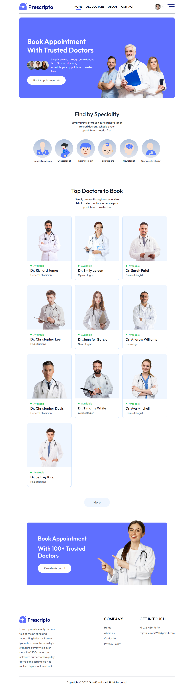
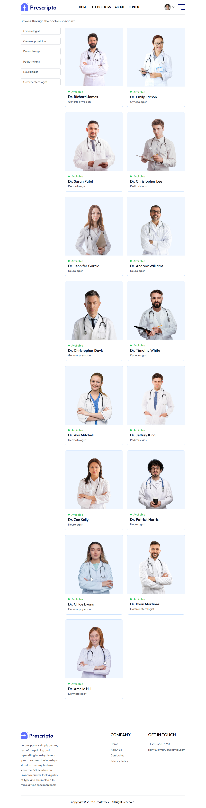
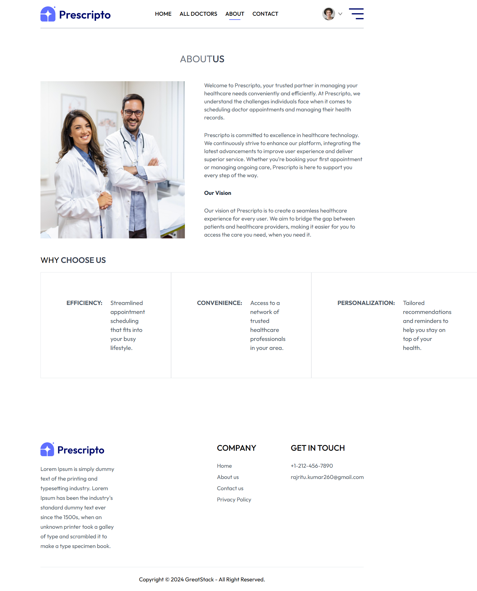
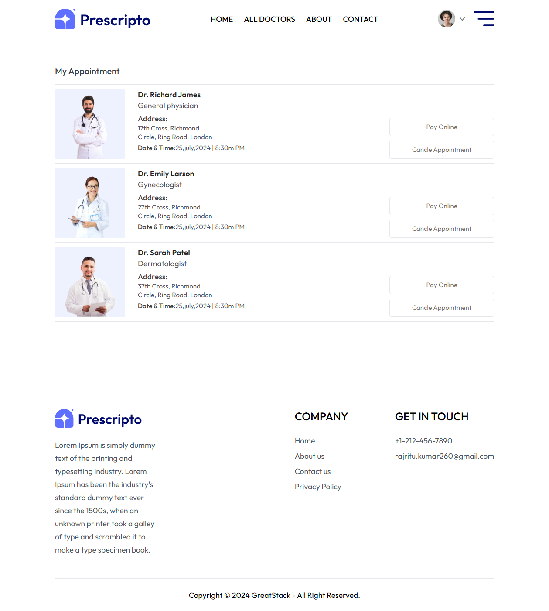
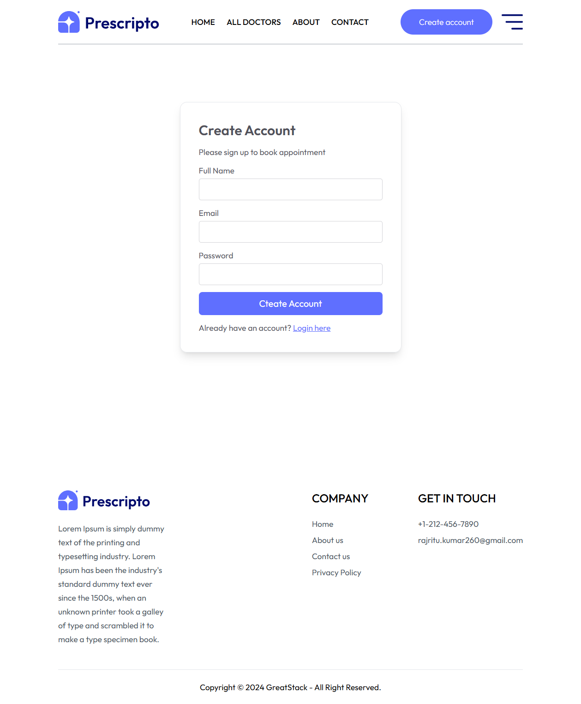
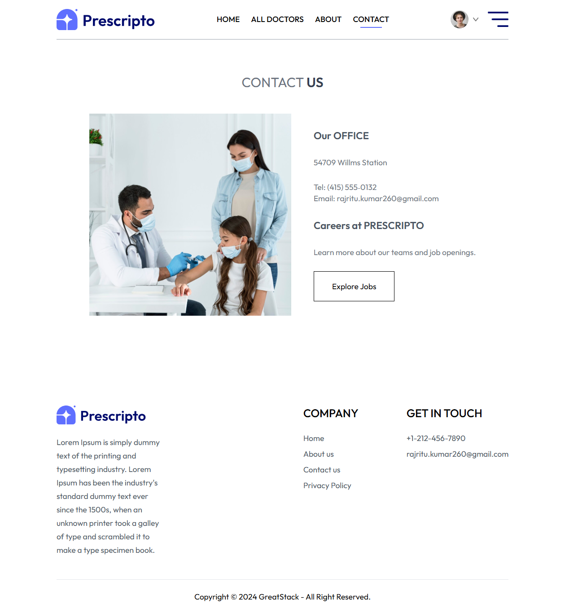

# Prescripto (MERN App)

Prescripto is a cutting-edge, full-stack web application engineered to revolutionize the way patients book appointments with doctors. Built on the MERN stack (MongoDB, Express, React, Node.js), this platform offers a seamless, responsive, and highly secure experience that caters to both patients and healthcare providers.

# Key Features and Functionality

- Intuitive User Interface:
  Leveraging React’s dynamic capabilities, Prescripto offers an engaging, easy-to-navigate interface. Patients can effortlessly search for doctors by specialty, location, and availability, while doctors can manage their schedules and view patient information through a clean, user-friendly dashboard.

- Robust Appointment Management:
  Patients can view real-time availability, select preferred time slots, and book appointments with just a few clicks. The system automatically updates the doctor's calendar, minimizes scheduling conflicts, and sends confirmation notifications via email or SMS.

- Responsive Design:
  The application is fully optimized for various devices—desktop, tablet, and mobile—ensuring that users can manage appointments and access healthcare information anytime, anywhere.

- Admin and Doctor Dashboards:
  A dedicated admin panel allows for efficient management of the overall system, including user roles, appointment tracking, and data analytics. Doctors benefit from personalized dashboards that offer insights into their schedules, patient interactions, and appointment histories.

